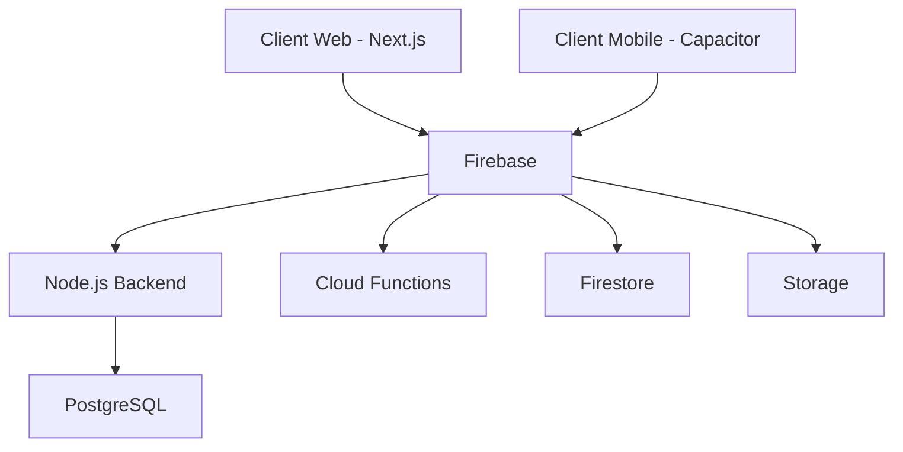
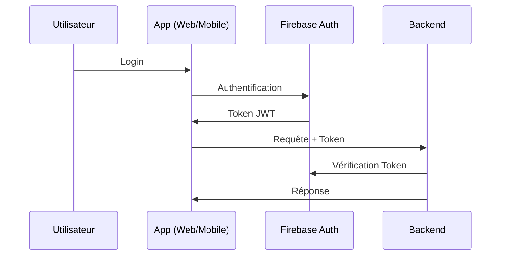
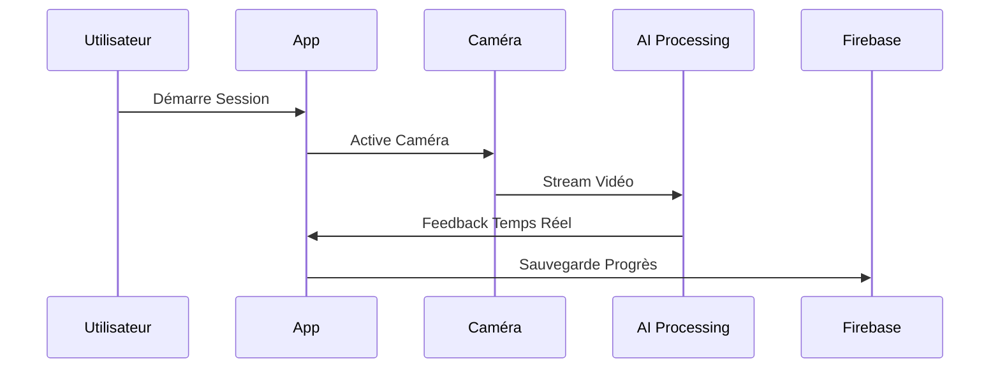

# KaporalFit - Documentation Technique (@kaporalfit.mdc)

## Structure du Projet

```bash
kaporalfit/
├── frontend/                 # Application Next.js
│   ├── public/              # Assets statiques
│   ├── src/
│   │   ├── app/            # Routes et pages Next.js
│   │   │   ├── (auth)/     # Routes authentification
│   │   │   ├── (dashboard) # Routes tableau de bord
│   │   │   └── (workout)   # Routes entraînement
│   │   ├── components/     # Composants React
│   │   ├── hooks/         # Custom hooks
│   │   ├── lib/           # Utilitaires et configurations
│   │   ├── store/         # État global
│   │   └── types/         # Types TypeScript
│   └── config/            # Configuration frontend
│
├── backend/                # API Node.js
│   ├── src/
│   │   ├── config/        # Configuration backend
│   │   ├── controllers/   # Contrôleurs API
│   │   ├── middlewares/   # Middlewares Express
│   │   ├── models/        # Modèles de données
│   │   ├── routes/        # Routes API
│   │   ├── services/      # Logique métier
│   │   ├── types/         # Types TypeScript
│   │   └── utils/         # Utilitaires
│   ├── prisma/            # Schémas et migrations
│   └── scripts/           # Scripts utilitaires
│
├── docker/                # Configuration Docker
│   ├── .github/          # CI/CD GitHub Actions
│   ├── frontend.Dockerfile
│   ├── backend.Dockerfile
│   ├── nginx.conf
│   └── docker-compose.yml
│
└── docs/                  # Documentation
    └── TECHNICAL_SPECS.md
```

### Points Clés de l'Architecture

1. **Frontend (Next.js 14)**
   - App Router pour le routage
   - Composants serveur et client
   - Intégration TailwindCSS
   - État global avec Zustand
   - Types TypeScript stricts

2. **Backend (Node.js/Express)**
   - Architecture en couches
   - Prisma pour l'ORM
   - Validation avec Zod
   - JWT pour l'authentification
   - Tests avec Jest

3. **Infrastructure**
   - Conteneurisation Docker
   - CI/CD avec GitHub Actions
   - Nginx comme reverse proxy
   - PostgreSQL pour la base de données

## 1. Vue d'Ensemble du Projet

### 1.1 Objectif
KaporalFit est une application cross-platform (web & mobile) qui révolutionne l'expérience fitness en combinant :
- Analyse posturale en temps réel
- Suivi personnalisé d'entraînement
- Fonctionnalités sociales et gamification
- Synchronisation parfaite web/mobile

### 1.2 Architecture Globale




## 2. Architecture Détaillée

### 2.1 Frontend Web (Next.js 14)
- **Structure du Projet**:
  ```
  src/
  ├── app/
  │   ├── layout.tsx
  │   ├── page.tsx
  │   ├── auth/
  │   ├── dashboard/
  │   └── workout/
  ├── components/
  │   ├── ui/
  │   ├── features/
  │   ├── styles/
  │   └── shared/
  ├── lib/
  │   ├── firebase.ts
  │   └── api.ts
  └── styles/
  ```

- **Fonctionnalités Clés**:
  - SSR pour performance optimale
  - Routes API pour logique backend légère
  - Intégration WebRTC pour flux caméra
  - PWA pour installation desktop

### 2.2 Application Mobile (Capacitor)
- **Configuration**:
  ```json
  {
    "appId": "com.kaporalfit.app",
    "appName": "KaporalFit",
    "plugins": {
      "Camera": {},
      "PushNotifications": {},
      "Storage": {},
      "App": {}
    }
  }
  ```

- **Fonctionnalités Natives**:
  - Accès caméra haute performance
  - Notifications push
  - Stockage local
  - Capteurs (accéléromètre, gyroscope)

### 2.3 Backend (Node.js + Firebase)

#### Firebase
- **Services Utilisés**:
  ```typescript
  interface FirebaseConfig {
    auth: {
      providers: ['google', 'email', 'apple'],
      customClaims: UserRoles
    },
    firestore: {
      collections: {
        users: UserCollection,
        workouts: WorkoutCollection,
        progress: ProgressCollection
      }
    },
    storage: {
      buckets: ['videos', 'profiles']
    }
  }
  ```

#### Node.js API
- **Structure**:
  ```typescript
  interface APIRoutes {
    '/api/workouts': WorkoutRoutes,
    '/api/analytics': AnalyticsRoutes,
    '/api/social': SocialRoutes,
    '/api/ai': AIRoutes
  }
  ```

## 3. Fonctionnalités Principales

### 3.1 Analyse Posturale en Temps Réel
```typescript
interface PostureAnalysis {
  // Flux Vidéo
  videoStream: {
    web: WebRTC,
    mobile: CapacitorCamera
  },
  
  // Analyse
  processing: {
    frameRate: 30,
    resolution: '1280x720',
    model: 'mediapipe-pose'
  },
  
  // Feedback
  feedback: {
    realtime: boolean,
    corrections: string[],
    confidence: number
  }
}
```

### 3.2 Synchronisation Cross-Platform
```typescript
interface SyncSystem {
  // État Local
  localState: {
    storage: 'IndexedDB' | 'SQLite',
    maxSize: '500MB',
    priority: ['workouts', 'settings']
  },
  
  // Sync
  cloudSync: {
    strategy: 'incremental',
    interval: '5min',
    conflictResolution: 'lastWriteWins'
  }
}
```

## 4. Flux de Données

### 4.1 Authentification


### 4.2 Workout Session


## 5. Déploiement

### 5.1 Web
- **Production**:
  ```bash
  # Build Next.js
  npm run build
  
  # Deploy to Vercel
  vercel deploy --prod
  ```

### 5.2 Mobile
- **Android**:
  ```bash
  npx cap add android
  npx cap sync
  npx cap open android
  ```

- **iOS**:
  ```bash
  npx cap add ios
  npx cap sync
  npx cap open ios
  ```

## 6. Monitoring et Analytics

### 6.1 Métriques Clés
- Temps de réponse API
- Taux de détection pose
- Engagement utilisateur
- Synchronisation cross-device

### 6.2 Alertes
```typescript
interface AlertSystem {
  performance: {
    apiLatency: '>500ms',
    errorRate: '>1%'
  },
  business: {
    userDropoff: '>10%',
    syncFails: '>5'
  }
}
```

## 7. Sécurité

### 7.1 Protection des Données
- Chiffrement en transit (HTTPS/SSL)
- Chiffrement au repos (AES-256)
- Sanitization des entrées
- Rate limiting

### 7.2 Conformité
- RGPD
- CCPA
- Stockage données EU

## 8. Roadmap Technique

### Phase 1 (M1-M2)
- [ ] MVP Web + Mobile
- [ ] Auth + Sync basique
- [ ] Détection pose simple

### Phase 2 (M3-M4)
- [ ] Analytics avancés
- [ ] IA améliorée
- [ ] Features sociales

### Phase 3 (M5-M6)
- [ ] ML personnalisé
- [ ] Marketplace
- [ ] API publique
